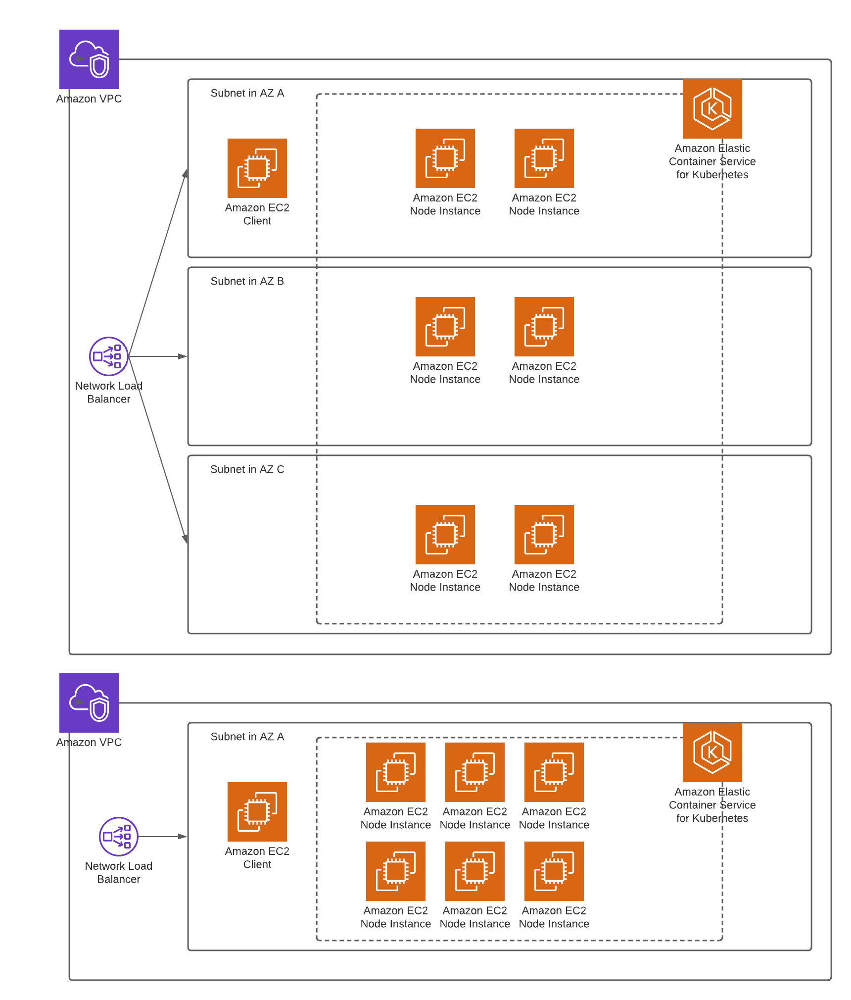

# ESLE-2021-G4

## Structure

- docker_swarm - Deployment using docker swarm
- report - Source of the generated report
- stress - `cassandra-stress` stuff: Dockerfile, results and workloads 
- terraform_code - Terraform configuration to deploy system in AWS with Kubernetes

## Kubernetes Cluster

To create an environment to study cassandra, a kubernetes cluster was deployed in AWS using EKS together with EC2 instances.

The cluster has the following representation:



Two types of instances were used for the experiments were c5.xlarge and c5.2xlarge. These instances have the following specs:

c5.xlarge:
- vCPU: 4
- RAM: 8GB
- Bandwidth: 10 Gbps
- Disk size: 20GB

c5.2xlarge:
- vCPU: 8
- RAM: 16GB
- Bandwidth: 10 Gbps
- Disk size: 20GB


There is a separate Instance which is used to execute the Cassandra stress client.

NOTE: The resources presented are not in the free tier. Creating the resources will have a cost!

### Building

Creating the cluster has four requirements:
- An AWS account
- Have Terraform installed -> https://www.terraform.io/downloads.html
- Have AWS's CLI installed -> https://aws.amazon.com/pt/cli/
- Have kubectl installed -> https://kubernetes.io/docs/tasks/tools/

To build the cluster it is required to:
- obtain access keys in the AWS security credentials console
- move to the 'terraform_code' folder
- create a copy of the terraform.tfvars.example and rename it to terraform.tfvars
- replace the values in 'terraform.tfvars' with the required credentials 

Only when these instructions are complete then it is possible to build the cluster.

To create all resources, execute the following commands:
- terraform init
- terraform apply

Verify if there aren't any problems and confirm by typing 'yes'.

After the operation is complete, the cluster is setup and running cassandra. 
To use kubectl, it must be configured first with the cluster credentials:
- aws eks --region `<used region>` update-kubeconfig --name `<cluster name>` --profile `<used profile>`

All resources refering directly to the cluster are created in the 'default' namespace.

### Cleaning all resources

Terraform is not deleting correctly the resources in the right order. It is necessary to destroy the resources of kubernetes first, and move forward with the rest.

To destroy the existing services (destroying the load balancer in the process) run:
- kubectl delete service --all

Then it is necessary to delete the terraform state refering to the kubernetes objects:
- terraform state rm 'module.k8_objects'
- terraform state rm 'module.helm_packages'
- terraform state rm 'module.k8_service_account'

To finish the process, it is only necessary to execute:
- terraform destroy

## Cassandra Stress

### Building

`cassandra-stress` is provided with Apache Cassandra, it has a Docker image, but it is not updated so we need to biuld it our selves. This can be done by using the following command

```
docker build -t stress ./stress
```

We can now use this image under the name `stress`

### Running

This tool provides us a lot of options for testing against Cassandra clusters, but since we have made our own workloads, we will only use a few of them.

We decided on a simple schema, simulating a small twitter platform, using 2 tables: one for users and other for tweets.
We have 2 files for `cassandra-stress` in the directory`stress`:
- `users.yaml` - for testing against the `users` table
- `tweets.yaml` - for testing against the `tweets` table

In both files we defined a keyspace to run our tests, called `minitwitter`, and in each of them we have the queries to create the tables (if they don't already exist) and also some parameters regarding the size of each column, the number of unique values per column as well as some queries to update and read rows from the database. (Insert queries are automatically handled by `cassandra-stress`).

In order to use our setup, we should mount directory `stress` in the container, so we use pass the flag `--mount type=bind,source="${PWD}"/stress,target=/data` (`/data` is just an arbitrary mount, we used it because it is simpler).

For the tool to use our files, we pass the option `user profile=/data/users.yaml,/data/tweets.yaml` we can optionally pass the duration of our tests with `duration=XY` (where `X` is a number and `Y` a unit - `s`, `m`, `h`).
The next option we need to use is `ops` which allows us to tell the ratio of queries of each type we want to run. Using multiple files we can select the queries using `specname.queryname`, in our case this can be `usr.login`. In case we want for each user that is registered, we want 5 logins, 30 tweets created and 50 tweet reads, the option becomes `ops(usr.insert=1,usr.login=5,tweet.insert=30,tweet.user=50)`.
We need to set also the value for consistency, and since Cassandra is used for reliability, we will run using `cl=QUORUM`.
In order to connect to the cluster, we need to pass the flag `-node` with the address in front of it.
Optionally we can log everything to a file using `-log file=/data/<name of logfile> level=<log level> interval=XY` with `log level` being a value among `minimal`, `verbose` and `normal` and `XY` with the same meaning as in `duration` (mentioned above).
We need to pass the option `-graph file=/data/<name of graph file>.html` in order to save the results and obtain a graph with all the points used, which is better for collecting the results from this tool.
Lastly, we can also pass the flag `-rate` and give it `threads=N`, `threads>=N` or `threads<=N` in order to set the exact number of clients, its minimum or its maximum, or instead we can pass `throttle=N` to the maximum rate of operations per second we want to test.

So, an example run can be:

```
docker run --mount type=bind,source="${PWD}"/stress,target=/data stress user profile=/data/tweets.yaml,/data/users.yaml duration=1m "ops(usr.insert=1,usr.login=5,tweet.insert=30,tweet.user=50)" cl=QUORUM -node cass_cluster -log file=/data/log level=verbose interval=1s -rate threads=4 -graph file=/data/graph.html
```

**NOTE:** the `ops` option needs to be inside quotes so it isn't interpreted as a shell function and in this example we assume `cass_cluster` is a cluster known by this container

To obtain our results, we ran these exact commands:
- `docker run --mount type=bind,source="${PWD}"/stress,target=/data stress user profile=/data/tweets.yaml,/data/users.yaml "ops(usr.login=25,tweet.user=50,tweet.count=1,usr.stats=1,usr.insert=3,tweet.insert=6)" cl=QUORUM -node k8s-default-mainlb-1b3a06ed87-6d62077ff579bf3c.elb.eu-west-1.amazonaws.com -log file=/data/log_write level=verbose interval=1s -rate "threads>=181" -graph file=/data/graph_write.html`
- `docker run --mount type=bind,source="${PWD}"/stress,target=/data stress user profile=/data/tweets.yaml,/data/users.yaml "ops(usr.login=25,tweet.user=50,tweet.count=1,usr.stats=1,usr.insert=3,tweet.insert=6)" cl=QUORUM -node k8s-default-mainlb-1b3a06ed87-6d62077ff579bf3c.elb.eu-west-1.amazonaws.com -log file=/data/log_write level=verbose interval=1s -rate "threads>=913" -graph file=/data/graph_write.html` - This one is ran only because the tool ran out of memory in the middle of the previous test, so we needed to run it this way (graph files were not generated when the tool failed, so we relied in the log files)

**NOTE:** to run with a single replica, we removed `cl=QUORUM`, which defaults to `LOCAL_ONE`

- Read workload (only with 3 replicas): `docker run --mount type=bind,source="${PWD}"/stress,target=/data stress user profile=/data/tweets.yaml,/data/users.yaml "ops(usr.login=1,tweet.user=1)" cl=QUORUM -node k8s-default-mainlb-1b3a06ed87-6d62077ff579bf3c.elb.eu-west-1.amazonaws.com -log file=/data/log_write level=verbose interval=1s -rate "threads>=181" -graph file=/data/graph_write.html`
- Write workload (only with 3 replicas): `docker run --mount type=bind,source="${PWD}"/stress,target=/data stress user profile=/data/tweets.yaml,/data/users.yaml "ops(usr.insert=1,tweet.insert=1)" cl=QUORUM -node k8s-default-mainlb-1b3a06ed87-6d62077ff579bf3c.elb.eu-west-1.amazonaws.com -log file=/data/log_write level=verbose interval=1s -rate "threads>=181" -graph file=/data/graph_write.html`

NOTE: This AWS domain is not available, it was just what we used when running those commands
